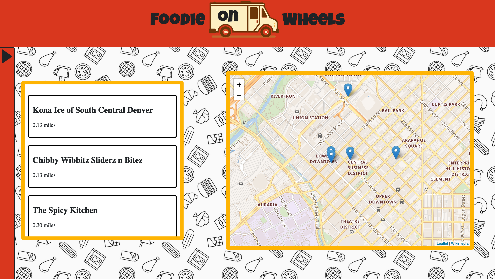

# Movie Tracker

## Descriptions:

This is a Web application that allows the user to view food trucks near them and see there info. it also allows user to change there location for future planning.

## Preview:



## Getting Started:

These instructions will get a copy of the project up and running on your local machine for usage and testing purposes.

### Front end

clone down the repository:
```
$ git clone https://github.com/Inzurriaga/Food-Truck.git
```

cd into directory and run npm install:
```
$ npm install
```

launch in your browser:
```
$ npm start
```

### Back end

clone down the repository:
```
$ git clone https://github.com/Inzurriaga/Food-Truck-Api.git
```

cd into directory and run npm install:
```
$ npm install
```

launch in your browser:
```
$ npm start
```

## Project Tools:
HTMl\
Javascript\
CSS\
React\
Sass\
React-Router\
Redux\
google api\
leaflet

## Future Development and Extensions Notes:

Future Development and Extensions would creating a whole backend to 

## Original Assignment
[Binary Challenge, Mod 3 at the Turing School of Software and Design](http://frontend.turing.io/projects/binary-challenge.html)

## Contributors
Gabriel Inzurriaga: https://github.com/Inzurriaga
